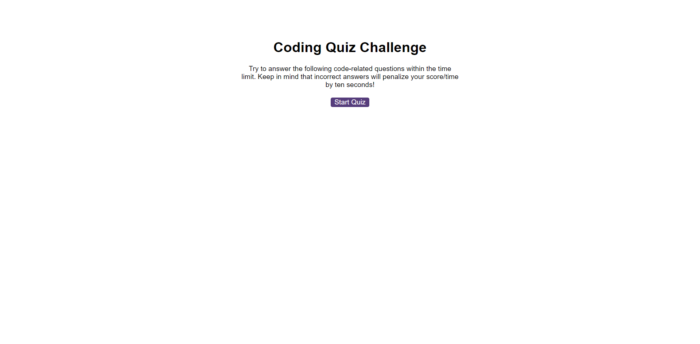

# rorys-javascript-fundamentals-quiz

A quiz to test your knowledge of the Javascript fundamentals.

## Description

This repository contains an interactive Javascript fundamentals quiz. It also contains a leaderboard, utilising the browsers Local Storage to allow the user to complete multiple attempts and track their scores.
The application was built using HTML, CSS and Javascript.

Features include:
* A startup splash screen to allow the user to start the quiz
* A 5 question multiple-choice quiz
* Sound effects and visual feedback for the selected answers
* An end-screen quiz that allows users to submit their score
* A leaderboard to display the scores, including the ability to clear the leaderboard

## Links

[Link to the deployed site](https://uberponky.github.io/rorys-javascript-fundamentals-quiz/)

[Link to the GitHub repository](https://github.com/uberponky/rorys-javascript-fundamentals-quiz)

## Installation

Access the deployed website via the links above. You can also clone the repository via Github and deploy locally to view the site.

## Usage

Once accessed / deployed, click on 'Start Quiz' to begin the quiz. A multiple choice question will be dynamically generated, and the process will repeat until the user reaches the final question.

To submit the score, the user can enter their initials (up to 3 alphabet characters) and select 'Submit'.

On the leaderboard the user can clear the leaderboard.

## Credits

[Geeks for Geeks](https://www.geeksforgeeks.org/javascript-program-to-check-if-a-string-contains-only-alphabetic-characters/) - I utilisised their Regex expression to validate the leaderboard initials input

## Contributing

N/A

## License

MIT License

Copyright (c) 2023 Rory Simmonds

Permission is hereby granted, free of charge, to any person obtaining a copy
of this software and associated documentation files (the "Software"), to deal
in the Software without restriction, including without limitation the rights
to use, copy, modify, merge, publish, distribute, sublicense, and/or sell
copies of the Software, and to permit persons to whom the Software is
furnished to do so, subject to the following conditions:

The above copyright notice and this permission notice shall be included in all
copies or substantial portions of the Software.

THE SOFTWARE IS PROVIDED "AS IS", WITHOUT WARRANTY OF ANY KIND, EXPRESS OR
IMPLIED, INCLUDING BUT NOT LIMITED TO THE WARRANTIES OF MERCHANTABILITY,
FITNESS FOR A PARTICULAR PURPOSE AND NONINFRINGEMENT. IN NO EVENT SHALL THE
AUTHORS OR COPYRIGHT HOLDERS BE LIABLE FOR ANY CLAIM, DAMAGES OR OTHER
LIABILITY, WHETHER IN AN ACTION OF CONTRACT, TORT OR OTHERWISE, ARISING FROM,
OUT OF OR IN CONNECTION WITH THE SOFTWARE OR THE USE OR OTHER DEALINGS IN THE
SOFTWARE.
